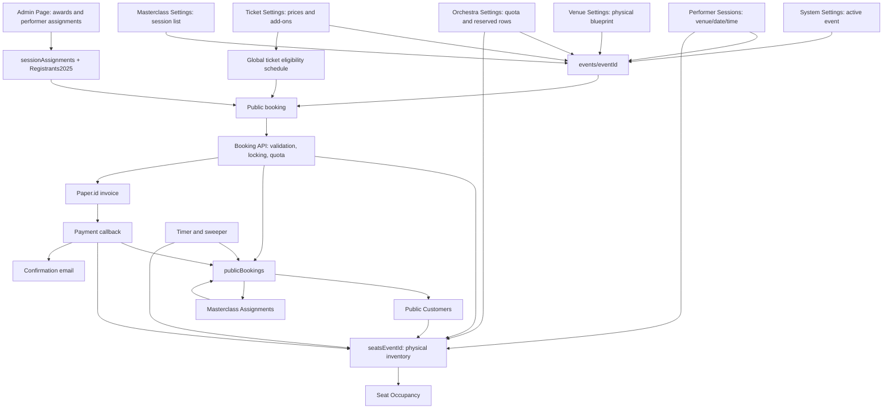

# Ticketing system audit — 6 September 2026

## Verdict and scope

The pages form a recognizable configuration → booking → payment → fulfillment flow, but the current implementation is **not ready to be described as reliable or bug-free**. The normal manually selected seat path works in an isolated check. Important rejection, expiry, authorization, capacity, and configuration paths do not.

This audit follows all Ticketing System menu entries, `PublicTicketBookingPage`, its API/service/repository, payment callbacks, expiry timer/sweeper, confirmation emails, and the separate **Public Customers** page. It evaluates the local checkout, not deployed Firebase data, gateway settings, hosting controls, or live customer transactions. No browser, build, real invoice, email, or live database mutation was used. The follow-up implementation adds the Admin Dashboard's **Masterclass Assignments** page; checkout failure findings A/D and the callback-error portion of F are repaired as described below; remaining findings are open.

## Follow-up repair status — 7 September 2026

This document preserves the 6 September evidence and original wording below. Subsequent local work repaired the thirteen reproduced assertions: cancellation-first timer/sweeper/failure cleanup, saved-event transactional payment fulfillment, tier-capacity reservation for unselected tickets, public sale-window enforcement, same-event winner/session validation, selected-seat product/uniqueness validation, and reserved-row enforcement for complimentary orchestra seats. The combined offline audit and checkout-failure boundary suite now reports **42 tests passed, 0 failed**.

This result is regression evidence only. It does not verify the real Paper.id callback/authentication contract, deployed Firestore indexes, a recovery worker, backend admin authorization, durable once-per-performance winner claims, or live customer/UI behavior.

**Second follow-up (7 September):** the reported public booking/admin UI defects were repaired locally. Public Orchestra purchases no longer send a complimentary `orchestraSessionId`; public paid maps and checkout both block winner-reserved rows; buyer/winner/session changes reset purchase state; and the winner notice uses purchased tickets rather than clicked seats. Public Customers no longer locally expires locks, verifies paid-seat assignment against current event/seat ownership/product rules, requires lock ownership for manual Mark Paid, and allows deletion only after confirmed terminal cleanup. The offline suite includes a new reserved-paid-row regression; UI behavior still needs owner-run browser verification.

## How the pages connect

| Menu entry | Actual responsibility | Data and downstream consumers |
| --- | --- | --- |
| System Settings (`14`) | Select the active event | `systemSettings/global.currentEventId` drives admin event selection and backend event/seat queries. Other global controls include exchange rate and registration status; registration status is not a ticket-sales switch. |
| Venue Settings (`17`) | Define venue identity, image, row/tier/count blueprint | `events/{eventId}.venues`; read by scheduling, price configuration, generators, seat maps, and assignment pages. Saving a blueprint does not reconcile existing seats. |
| Performer Sessions (`19`) | Define each venue's dated time ranges; generate seat documents | `venues[].sessions`, `sessionsSeatsGenerated`, and `seats{eventId}` via `uploadFullSeatLayout`. The time ranges are also the selectable pool for orchestra and masterclass settings. |
| Ticket Settings (`18`) | Ticket tiers, venue-specific prices, add-ons, and sale dates | `events/{eventId}.ticketTiers` / `addOns`; eligibility is stored globally in `systemSettings/global.ticketEligibility`. |
| Orchestra Settings (`15`) | Designate a venue/time slot as orchestra; manage reserved rows and complimentary quota | `orchestraSessions`, `complimentaryClaimed`, generated seats. The winner's complimentary booking targets this separate orchestra selection. |
| Masterclass Settings (`23`) | Designate a venue/time slot as a standalone masterclass | `masterclassSessions`. Public booking sells the `masterclass` tier without a seat map. Sessions have no attendee limit for now. Masterclass Assignments (`25`) fulfils complimentary benefit passes after payment. |
| Seat Occupancy (`22`) | Count and inspect generated seat documents | Reads `seats{eventId}` by venue/session. It does not account for paid tickets lacking seat assignments, and is refreshed on load/button rather than a realtime subscription. |
| Admin Page (`2`) | Sync awards and assign performers to sessions | Renders `SessionAssignmentManager`; saves `sessionAssignments/{eventId}`. Eligible winner lookup joins those assignments with `Registrants2025.finalAward`. This is not the customer-order administration page. |
| Public Customers (`16`, outside submenu) | Inspect orders, resend emails, assign missing paid seats, manually mark paid, delete bookings | Reads/writes `publicBookings` and seats. These actions directly affect the same inventory and payment state as checkout and callbacks. |



## Actual customer paths

**Public buyer:** select a competition, orchestra, or masterclass session → choose tier quantities → optionally buy a per-seat `seat_selection_performer` add-on and select those seats → enter buyer contact information → review → POST booking → open Paper.id → poll the waiting page. Standalone masterclass skips map/add-ons.

**Registered winner:** choose an eligible assigned registrant → the **paid competition venue/date/time comes from their existing assignment** → choose a separate orchestra session → buy competition ticket quantities → optional paid-seat selection → receive `min(purchased quantity + 1, remaining orchestra quota)` complimentary tickets → optionally pay the flat `seat_selection` add-on to select orchestra seats → details → checkout. It makes sense to choose the orchestra session here because it is distinct from the already assigned competition session.

The current free-Masterclass benefit is a saved `freeMasterclassCount` derived from Presto quantity. The owner confirmed that standalone paid Masterclass tickets stay attached to the customer-selected session, while an admin assigns all complimentary passes from one booking to the same specific Masterclass session after payment. The customer does not choose the free session during checkout. Masterclass sessions have no attendee limit for now. The new Masterclass Assignments page writes the selected session and quantity to `masterclassAssignment`; the `allegro_masterclass` add-on likewise records a purchase, not a session assignment.

**Approved extension, not implemented:** admin assigns paid `allegro_masterclass` add-on passes later, together with any complimentary passes from the same booking, to one Masterclass session after payment, then emails the buyer. Include bookings containing only paid add-on passes. Standalone Masterclass tickets remain attached to the customer-selected session. The existing assignment page handles only complimentary Presto passes and does not send assignment emails.

## Confirmed high-priority findings

### A. Failed checkout can release someone else's sold or held seat — repaired 7 September

**Evidence:** `PublicTicketRepository.js:503–547`; offline test “rejected booking must preserve another buyer’s booked seat”.

A seat conflict correctly fails the booking transaction. The outer catch then unconditionally sets every submitted seat to `available`, without checking whether this attempt ever acquired it or whether another booking owns it. The test starts with a `booked` seat owned by another customer and ends with it `available`. Errors during price validation can also enter this cleanup. Quota rollback can subtract an allowance that was calculated but never successfully claimed.

Repair: failure cleanup now uses the persisted booking and current seat ownership, performs no inventory changes for rejected transactions, and refunds stored quota once atomically. The preceding description and line references record the original defect.

### B. Tickets without manual selection do not reserve physical capacity

**Evidence:** `PublicTicketRepository.js:213–234,297–307,359–391,591–605`; offline zero-inventory test.

Only `selectedSeatIds` and `orchestraSelectedSeatIds` are locked or finalized. Checkout accepts 100 Presto tickets with no inventory and no selected seats in the fixture. There is no capacity ledger or automatic allocation in checkout/payment. The admin page can assign missing **paid** seats later, but that does not prevent overselling and it has no equivalent complimentary-orchestra assignment action. Its “Auto-Assigned” label does not prove seats exist.

Follow-up: the owner requires admin assignment from Seat Occupancy. Capacity must still be protected before assignment; the owner confirmed that admin assignment is allowed only after payment.

### C. Complimentary expiry fails; lazy expiry also strands quota

**Evidence:** `PublicTicketRepository.js:442–487`; `PublicTicketSweeper.js:37–77`; tests cover both actual callbacks.

Both cleanup transactions update the booking/seats before reading the event for quota refund. The installed Firestore SDK explicitly rejects reads after writes (`node_modules/@google-cloud/firestore/build/src/transaction.js:36,97,143`). The fixture enforces that same rule and both tests leave the booking `pending` with quota unreleased.

Separately, taking over an expired seat marks its old booking `expired` but does not refund quota or cancel its invoice. The timer/sweeper process only `pending` bookings, so they subsequently skip it. A separate test reproduces the stranded quota.

**Approved, not implemented:** keep seats held until Paper.id confirms payment or successful cancellation, even beyond 30 minutes. Confirmed payment must finalize the booking and retain its inventory; successful cancellation permits unpaid inventory release. Failed cancellation or an unknown invoice outcome must keep inventory unavailable for reconciliation. A local deadline alone is not permission to release or take over seats. This applies to timer, sweeper, lazy takeover, seat availability reporting, and checkout-failure cleanup; all remain follow-up lifecycle work.

**Follow-up status (7 September):** implemented locally. Timer, sweeper, and checkout failure cleanup retain inventory until cancellation returns truthy, lazy takeover is removed, and failed/unknown cancellation remains reconciliation-only.

### D. Invoice failure leaves a pending booking behind — repaired 7 September

**Evidence:** `PublicTicketRepository.js:359–419,500–557`; offline invoice-failure test.

The booking is created before the Paper.id call. If invoicing fails, seats are released but the booking stays `pending`. Later sweeping can release those seats again after someone else acquires them, because seat ownership is not checked in normal expiry cleanup. Repair: invoice failure cleanup retains a terminal `failed` booking, releases only its owned locks, and records cancellation/refund outcomes. Database cleanup failure leaves allocations intact and requires recovery from logs. The successful invoice result still does not persist `paymentUrl`, despite the status endpoint trying to return it; this is outside this batch.

**New policy dependency:** the repaired helper releases owned seats and refunds quota before cancellation confirmation. Its earlier scope is complete, but its release timing does not satisfy the newly approved hold policy and must change alongside expiry.

### E. Payment and admin API trust boundaries are missing in the local Express application

**Evidence:** `apcs_service/index.js`; `routes/PaymentRoute.js:107–122`; `routes/PaperRoute.js`; both webhook controllers; `PublicTicketRepository.js:565–615`.

No authentication/signature or gateway lookup is wired ahead of either paid webhook. The dedicated webhook accepts a caller-provided invoice number and `paid` status. Fulfillment does not validate the invoice identity, expected amount/currency, or current seat owner. The amount and seat-owner failures are reproduced offline. The global limiter is not authentication.

Global settings updates and session-assignment writes also lack application-level admin authorization on their routes. An upstream protection might exist, but it was not verified; a frontend whitelist does not authenticate requests to the backend Admin SDK.

The webhook reads booking state and later writes a batch rather than making fulfillment a conditional transaction. This also leaves a payment/expiry race. Both controller paths acknowledge processing exceptions with HTTP 200, so failed fulfillment is not exposed as a retryable callback failure.

### F. Eligibility and entitlement checks do not match the UI

**Evidence:** `PublicTicketRepository.js:155–169,199–234,297–305`; offline closed-window, nonexistent-winner, and arbitrary-orchestra-seat tests.

Public checkout never checks the `Public` eligibility window. A `registrantId` alone determines winner status. When date restrictions are disabled, the registrant document is not validated at all; a nonexistent ID receives complimentary quota. When enabled, checkout checks the award but not the current event/assignment eligibility. The public winner endpoint publishes names and email addresses. The owner subsequently approved name selection without email verification; missing identity verification is not a requested repair. Eligibility and entitlement validation remain required.

Orchestra seat IDs are accepted even for a public buyer with no complimentary entitlement. There is no per-registrant claim ledger to distinguish first and repeat complimentary purchases. Follow-up: the extra winner ticket is allowed only once per winner per orchestra session; the missing claim tracking is therefore a confirmed rule violation.

Repaired 7 September: eligibility reads now run inside the checkout error boundary and database errors settle the callback. Checkout now also enforces the public sale window, validates a real same-event winner and their assigned session, and rejects nonwinner complimentary orchestra selection. Durable once-per-performance claim accounting remains open.

### G. Selected seats are not checked against the purchased product

**Evidence:** `PublicTicketRepository.js:213–222,331–357`; offline mismatched-seat and duplicate-ID tests.

The API checks total manual selection count and seat availability, but not venue, date/session, tier, unique physical seats, reserved rows, or overlap between paid/free arrays. A different venue/session Presto seat can be selected while paying for Lento. Duplicate IDs count twice. Unknown add-ons are ignored for pricing even though their IDs can activate selection logic. Quantities also lack strict positive-integer and upper-bound validation.

**Follow-up status (7 September):** checkout now rejects duplicate/overlapping physical IDs and validates paid seats against the requested event/venue/date/session/tier, ticket quantities as positive integers, and free orchestra seats against the configured orchestra slot and reserved rows. Unknown-product/add-on hardening remains a separate review item.

### H. Two generators create different IDs for the same physical seat

**Evidence by code review:** `SeatEvent.js:61,95`; `OrchestraSettings.js:91,176`.

For the same venue/tier/row/number/event/session:

```text
Performer generator: V1-Presto-A1_APCS2026_2026-11-01_09:00-10:00
Orchestra generator: V1-Presto-A-1_APCS2026_2026-11-01_09:00-10:00
```

Neither generator reconciles the other's format. Both documents match the same map query and represent one physical chair twice. The current documentation's former claim of a single rigid ID was inaccurate.

Creating a **new** orchestra session uses unconditional `batch.set`; another orchestra entry for an existing physical slot can overwrite existing held/booked seats. The regeneration paths use read-then-batch snapshots, so their preservation checks are not atomic against concurrent purchases. `uploadFullSeatLayout` even writes preserved snapshots back. Tier/row edits also change IDs or leave obsolete seats without reconciliation.

### I. Configuration editing can overwrite active claims or orphan bookings

**Evidence by code review:** `OrchestraSettings.js:66–143`; Venue/Performer/Masterclass save/delete handlers.

Orchestra save/delete replaces the entire locally cached session array, including `complimentaryClaimed`. If checkout increments quota after the admin loads the page, a later admin save can restore the older count. Reordering/deleting sessions also races with booking code that retains an array index from outside its transaction.

Venue/date/time deletion does not check assignments, paid orders, active holds, or dependent orchestra/masterclass entries. Changing an orchestra session's date/time retains its ID while existing seat/order references retain the old slot. These operations need dependency-aware behavior before active sales can safely coexist with editing.

### J. Frontend state can mix different bookings

**Evidence by code review:** `PublicTicketBookingPage.js:63–106,495–514,630–638,717`.

Going Back and changing the buyer, winner, or session does not clear previous cart/seat/add-on state. The payload sends `selectedWinner?.registrantId` even after switching back to Public Buyer, so the backend can treat that public checkout as a winner. A session change can retain old seat IDs while displaying/pricing the new venue; missing backend relationship checks permit the mismatch.

The public session list adds orchestra and masterclass entries, then **all** their underlying venue time slots again as competition sessions. The same orchestra/masterclass slot is consequently offered under different product types. Seat Occupancy repeats orchestra slots as competition rows too.

### K. Pricing and reserved-row controls have inconsistent scope

**Evidence by code review:** `PublicTicketBookingPage.js:311–314,384–391,439–441`.

`hasMissingPricing` requires prices for every tier at the venue, including hidden/unpurchased masterclass tiers; this can block otherwise valid competition orders. The masterclass Continue branch ignores that same check, allowing the customer to proceed with “Price N/A” until backend rejection.

Reserved rows are only blocked when the performance seat-selection add-on is absent. The map itself is shown only when that add-on exists, so public buyers viewing the map can select reserved rows. For winners, the paid map also reads reservation metadata from the selected orchestra session rather than the assigned competition session. Follow-up: the owner confirmed that these rows are for winners’ complimentary tickets; paid selection must not bypass this restriction.

### L. Event switching, confirmation, and recovery have gaps

**Evidence:** `PublicTicketRepository.js:576–589`; `PublicTicketController.js:13–31`; `WaitingPayment.js:13–15,30–38,76–82`; `EmailService.js:2942–2987`; confirmation template.

Payment fulfillment uses the current global event, not the booking's saved `eventId`. Switching the active event while a payment is pending targets the wrong seat collection; reproduced offline. Venue labels are also resolved against the current event.

Duplicate paid handling returns the stored document without its ID, but the controller sends another email anyway; the second email can have an undefined booking ID. The confirmation omits the separate orchestra venue/date/time, complimentary counts without selected labels, masterclass benefits, and add-on detail. There is no public-booking QR in this template; the legacy JWT verifier queries competition registrants instead.

The waiting page relies on router state to choose public versus registration polling and recover the payment link. Opening the URL independently loses that state. The timer still declares expiry and stops polling based on the browser clock; the checkout-failure repair removed its unverified claim that the invoice was canceled. The gateway invoice itself has a next-day due date, and ordinary expiry cancellation failures are not reconciled, so local expiry is not proof that payment is impossible. A paid callback received after local expiry is rejected even if gateway settlement occurred earlier; reconciliation is absent.

### M. Customer administration can bypass booking invariants

**Evidence by code review:** `PublicCustomersList.js:99–105,241–302,327–430,617–642`.

Manual Mark Paid is available for expired orders and overwrites seats without validating ownership. Missing-seat assignment does not validate tier-specific remaining quantities or recompute the outstanding count inside its transaction; two administrators with stale dialogs can overassign. The modal excludes `master_class`, while the actual public product uses `masterclass`. Deletion conditionally releases owned seats, but does not refund complimentary quota or cancel a pending invoice before deleting the booking record. Resend reports success without checking the API wrapper's returned `{ error }` value.

## Verification record

### Checkout failure repair — 7 September 2026

Previous recorded offline run (not rerun for this documentation update): **36 tests: 23 pass, 13 fail** across the repository audit and the additional Paper/admin boundary checks. The original three failures targeted by this batch now pass, as do all three original controls and 17 added regression cases. The 13 failures are existing deferred defects, not waived tests: capacity without seats; closed public sale windows; nonexistent winners; wrong venue/session/tier seats; duplicate seats; complimentary timer expiry; complimentary sweeper expiry; payment using the active event instead of the booking event; payment overwriting another owner's seat; incorrect payment amount; unauthorized orchestra selections; quota stranded by lazy expiry; and missing booking ID on duplicate payment callbacks.

```sh
node --test --test-reporter=spec apcs_service/audit/public-ticket.audit.cjs apcs_service/audit/checkout-failure-boundaries.audit.cjs
```

The full command intentionally still exits nonzero while deferred safety failures remain. Focused repair checks use `--test-name-pattern='FAILURE|CONTROL|rejected booking|invoice failure|eligibility database failure'` on `public-ticket.audit.cjs` (20 passing, 13 skipped); run the boundary file separately (3 passing). Backend syntax and frontend lint checks pass with zero errors; the two changed frontend files retain three existing lint warnings. Manual Mark Paid is checked by executing its actual handler with a failed stored booking and a stale pending row; no browser is rendered. Paper error handling is exercised with a fake provider response containing an invoice ID but no payment URL.

The test fixtures enforce transaction read ordering and atomic writes but do not simulate real Firestore contention or deployment authorization. No live invoices, emails, database changes, or browser verification were used. Complete payment/expiry race handling and automated cancellation/reconciliation recovery remain outside this repair. Manual failed-booking display checks are in the staff guide.

### Original baseline

Command from the monorepo root:

```sh
node --test apcs_service/audit/public-ticket.audit.cjs
```

**Original audit baseline: 19 targeted cases, 3 controls passed and 16 safety assertions failed.** These are deliberately selected diagnostic cases, not a coverage percentage or 16 unrelated bugs. Tests load the real repository and sweeper through an allowlisted VM dependency boundary, with a fixed clock, callback-driven fake Paper.id, and an in-memory atomic writer enforcing Firestore read order. No network or credentials are used. The harness does not model real contention/retries, real gateway payload contracts, or deployment security.

Passing controls: authoritative price calculation plus normal selected-seat payment; eligible winner → assigned performance session lookup; ordinary public expiry without complimentary quota.

Additional static checks: ESLint on 15 ticketing-related frontend files reports **0 errors / 36 warnings**. `node --check` passes for 10 related backend files. These checks do not establish runtime correctness. No browser or build was run, following project rules.

Follow-up implementation check (7 September): ESLint on `MasterclassAssignments.js` and its `AdminDashboard.js` wiring reports **0 errors**. The page's bounded Firestore query, paid/event/session transaction checks, and documentation/index changes were reviewed statically; no browser or live Firestore mutation was used.

## Confirmed business rules — follow-up to the 6 September audit

These are owner-confirmed requirements; the complimentary-only Masterclass assignment page is implemented, while paid add-on assignment/email remains pending. The provider-confirmed hold policy is implemented in the local lifecycle paths but still needs real-provider verification and recovery operations:

- When a buyer does not purchase the corresponding seat-selection add-on, an admin must be able to assign the seat from **Seat Occupancy**. The current page is read-only; the existing Public Customers paid-seat assignment is not the complete requested workflow.
- The winner's extra **one complimentary orchestra ticket** is available **once per winner per orchestra session**, across separate purchases. This clarification concerns the extra winner ticket; it does not remove the existing per-purchased-ticket benefit. An ensemble counts as one winning performance: it receives one extra winner ticket per orchestra session, not one per member. An unpaid booking that expires does not consume this extra ticket entitlement; the winning performance may claim it again when retrying. Restoring eligibility does not guarantee that session quota or reserved-row capacity remains available.
- Orchestra **reserved rows are for winners' complimentary tickets**. Ordinary paid-ticket buyers must not gain access merely by purchasing seat selection. All complimentary orchestra seats must stay within these reserved rows, including customer-selected seats and admin assignments from Seat Occupancy; they must not spill into ordinary paid rows.
- Admin assignment and inventory protection are separate: unassigned tickets still need capacity protection to prevent overselling. Admins may assign seats from Seat Occupancy only after payment is confirmed. Pending, expired, or failed bookings are not eligible for admin seat assignment.

## Owner decisions resolved; engineering work remains

- Seat Occupancy must show how many seats need assignment; assignment remains paid-only.
- Public buyers enter their email. Winner selection defaults the editable buyer email to the registrant’s stored email; confirmation uses the saved booking `userEmail`. Keep public winner name selection without email verification. Confirmation email is communication, not identity proof; backend winner eligibility and once-per-winning-performance/per-orchestra-session entitlement checks are still required.
- Booking-ID/manual entry verification is sufficient; public-ticket QR is not required. Whitelist membership grants all ticketing-admin powers; backend routes must enforce membership.
- **Implemented locally, pending provider verification:** seats remain held until Paper.id confirms payment or cancellation. The timer, sweeper, failure cleanup, seat reads, and fulfillment no longer free or take over inventory based solely on the local deadline. Failed/unknown outcomes require reconciliation.
- **Approved extension, not implemented:** admin assigns paid `allegro_masterclass` add-on passes later, together with any complimentary passes from the same booking, to one Masterclass session after payment, then emails the buyer. Include bookings containing only paid add-on passes. Standalone Masterclass tickets remain attached to the customer-selected session. The existing assignment page handles only complimentary Presto passes and does not send assignment emails.

The handover preserves the original answers. Do not reopen these choices. Verify provider payment/cancellation semantics and stable performance keys in the existing records, then design durable recovery and safe lifecycle transitions. Those are outstanding engineering tasks, not unanswered owner preferences. Ask genuinely new blocking questions one at a time and wait without assuming an answer from elapsed time.

## Manual verification after fixes

Use a controlled test event and gateway test configuration. Confirm setup in all eight menu entries, then test public competition/orchestra/masterclass purchases and winners with different assigned competition/orchestra venues. Cover no/partial/full manual seat selection, sold-out inventory, reserved rows, closed sale dates, Back → change session/buyer, duplicate payment submission, invoice failure, concurrent checkout, expiry with complimentary quota, delayed/repeated callbacks, active-event changes, and all Public Customers actions. Verify booking counts, seat ownership, quota, invoice state, email content, and entry verification agree. Browser checks are for the user to perform.

## Self-review

Standards: no restricted commands/browser use; callback failure and database ownership risks identified. Spec: all requested pages plus connected fulfillment/admin paths traced. Hygiene: the Masterclass Assignments page and dashboard wiring are scoped to paid bookings and preserve unrelated changes. Consistency: document claims distinguish current behavior, the new assignment workflow, reproduced failures, code-review findings, and confirmed business rules with pending implementation. The checkout failure repair is verified offline; no deployment or complete ticketing-readiness claim is made.

## Launch-hardening implementation update (8 September 2026)

The five reproduced checkout/UI defects now have offline regression coverage. The public repository rejects forged product flags, excludes complimentary Orchestra rows from paid capacity, creates a canonical physical-seat ownership record, persists a once-per-session winner personal claim, and returns the existing booking/invoice for a repeated idempotency key. The waiting page no longer converts a local deadline into `EXPIRED` or stops authoritative polling.

Offline evidence: `node --test --test-reporter=spec apcs_service/audit/public-ticket.audit.cjs apcs_service/audit/checkout-failure-boundaries.audit.cjs` completed with **48 passing tests**. This remains an in-memory diagnostic; Firestore-emulator contention, 500-buyer rehearsal, Paper.id callback registration/authenticity, sandbox cancellation semantics, admin authorization, assignment/email completion, and owner browser acceptance are still release gates.
